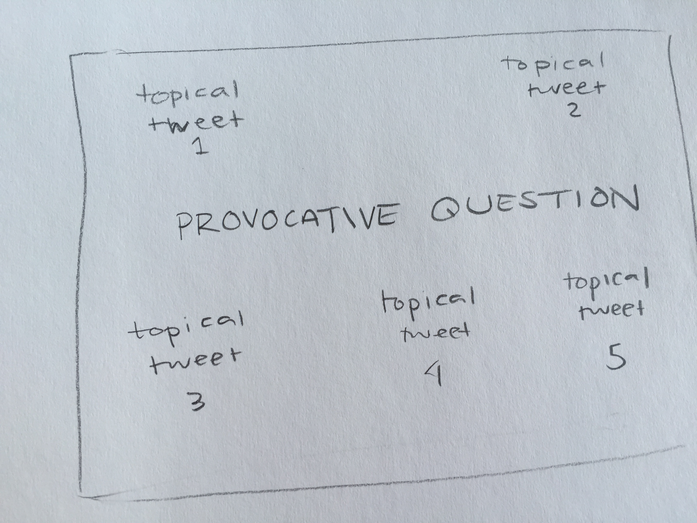

# Final Project Proposal
tEchoChamber is an openFrameworks application that uses RFID technology to raise awareness on the spectrum of opinions around various prevalent social issues. tEchoChamber is meant as a window outside of our everyday echo chambers. Designed in the vain of popular open-source card games Cards Against Humanity and The Metagame, tEchoCamber's "controllers" are RFID cards with icons representing different social problems facing today's society. When the player waves a card by the RFID reader, the application scrapes Twitter for specific keywords related to the issue. Several of the most recent tweets about the topic are displayed, along with a question meant to challenge the player to consider their true opinion on these matters. 

In light of recent uprisings across the United States, I think it is important to have discussions about the polarized opinions our soceity has developed about what's happening in our world. So often we are surrounded mostly by people who have similar opinions, creating an echo chamber that further polarizes opinions. By exposing the player to a variety of opinions around a topic on one screen, they are encouraged to consider the opinions others, opinions they may not have been aware of before.

